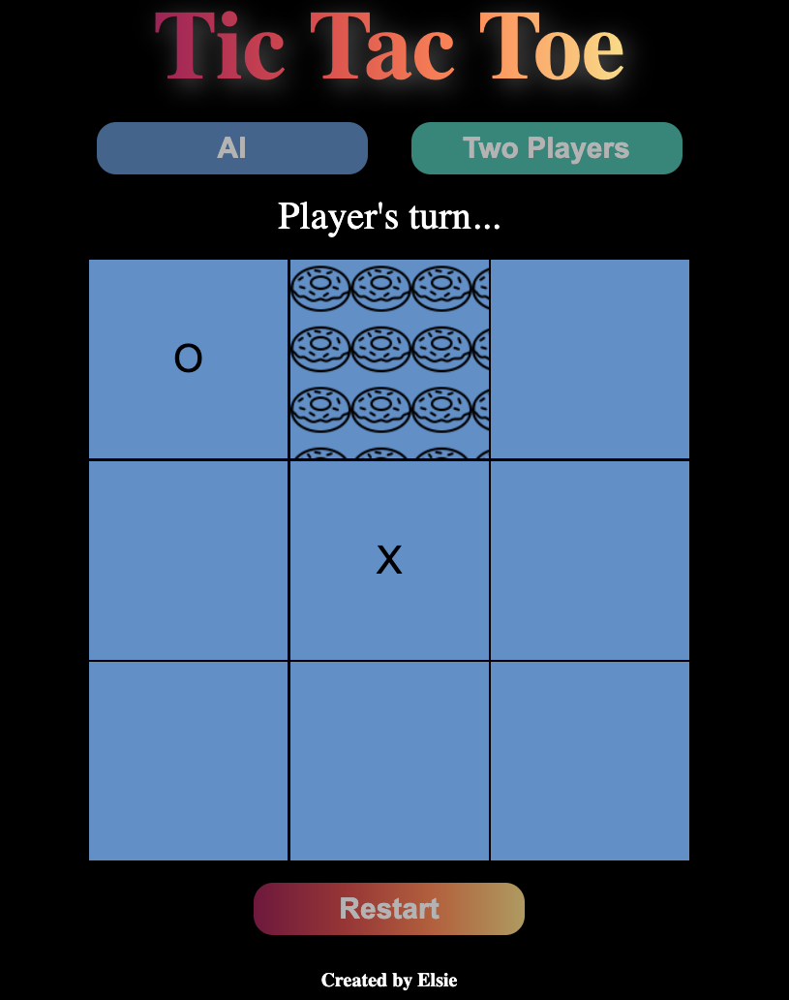

# Tic-Tac-Toe
This is a Tic Tac Toe game written in JavaScript you can play in your browser!

## Table of Contents
- Demo
- Technologies Used
- Features
- Credits
## Demo
Check out the [**live**](https://elsiechen.github.io/Tic-Tac-Toe/) demo.

## Technologies Used
- HTML
- CSS
- JavaScript

## Features
- Create simple AI player using JavaScript
- AI and two players mode to choose
- Different hover images on cell for player differentiation

## Credits
- The Odin Project: [Sign-Up Form](https://www.theodinproject.com/lessons/node-path-javascript-tic-tac-toe)